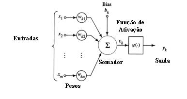
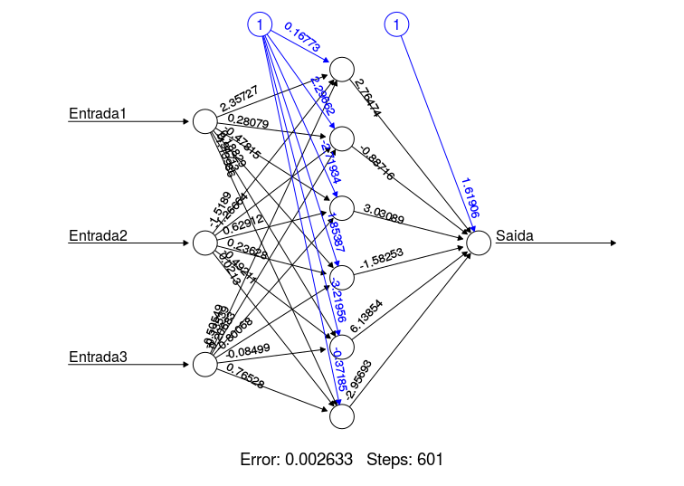

# Introdução

## Finanças Comportamentais

 

@barber2014day conclui que 90% das pessoas que entram  no mercado financeiro acabam perdendo o seu dinheiro no longo prazo. Para tentar explicar essa alto grau de fracasso, surgiu um ramo das finanças chamada Finanças Comportamentais. Boa parte desse estudo deriva dos fundamentos da Prospect Theory, escrita por @kahneman1979prospect (Nobel de economia em 2002)  e busca compreender o comportamento do investidor em contextos que envolve ganhos e perdas. Um exemplo é o artigo escrito por @shefrin1985disposition que explica o efeito disposição, que está associado com a tendência que o investidor têm de realizar cedo demais os trades lucrativos e manter aqueles com perdas.

Como demonstrado por @list2004neoclassical esse comportamento contraria a premissa básica que dá sustentação à maior parte  da teoria econômica e financeira moderna, que é fundamentada na racionalidade, dos agentes econômicos. De acordo com essa suposição, todos os agentes econômicos são 100% racionais, isso é, tomam decisões que maximizam a satisfação ou utilidade desses agentes.
 
 

###Prospect Theory

 
 

A função valor, figura \@fig:funcao, criada por @kahneman1979prospect, representa o valor que os indivíduos atribuem para determinados níveis de ganhos ou perdas. Assim mostrando que pessoas demonstram aversão ao risco quando estão ganhando e uma propensão ao risco quando estão perdendo. Isso implica que os investidores têm comportamentos diferentes, quando estão ou não lucrando em sua posição de ativos de riscos. Dessa forma este provavelmente irão "realizar" os lucros rapidamente, enquanto que tenderão a "segurar" por mais tempo a sua posição perdedora, na esperança que o mercado vire. Isso ocorre porque o psicológico das pessoas vai tentar indicar o caminho mais conveniente, seja valorizando os seus egos ao fazê-las realizar logo o lucro obtido, ou postergando a realização do prejuízo para minimizar o desconforto causado em seus egos e autoimagens pelo reconhecimento da perda.

{#fig:funcao}

Então esse viés cognitivo pode gerar redução dos ganhos e um aumento de perdas para os investimentos em artigos de riscos. Basicamente o investidor se torna "medroso" quando está lucrando, assim fechando o trade antes que ele chegue no objetivo e "corajoso" quando está perdendo, assim deixando o trade aberto mesmo quando já é visível que ele deu errado.

 
 

##Machine Learning

 
 

Segundo @james2013introduction, Machine Learning ou Aprendizado de Máquina, se refere ao enorme conjunto de técnicas que visam criar sistemas computacionais cujo comportamento seja definido com base em dados já existentes. O comportamento do sistema não seria diretamente programado, mas sim adaptado de um conhecimento previamente adquirido, essa aprendizagem se assimila muito a forma em que humanos aprendem, com a experiência. Uma forma mais abstrata de definir a inteligencia é a capacidade de se adaptar com a experiência, logo o machine learning devera ser capaz de se adaptar conforme observa os efeitos de suas ações no meio em que está inserido. 

### Neurônio Artificial

Como demontrado por @kriesel2007brief, o neurônio artificial é uma estutura logica-matematica que busca imitar as funções neurologicas humanas. Contendo três elementos:

- Pesos  Sinápticos.
- Função de Soma.
- Função de ativação.

{#fig:neuronio}

Como visto na figura \@ref(fig:neuronio), o neuronio recebe os valores de entrada com seus respectivos pesos, que são trasformados pela função soma e fornece uma saida que é dada pela função de transferencia.

As entradas podem ser as entradas extrenas, saídas de outros neurônios, um bias ou qualquer combinação destes elementos. Onde o bias é é um erro sistemático diferentemente de erro aleatório.

A função de ativação tem como objetivo somar todas as entradas por seus respectivos planos.
Onde essa função é dada por, onde n é o valor de entrada no neuronio e p é o peso atribuido a ele: 

$$
f(x) =  \sum(n * p)
$$

## Redes Neurais Artificiais

A partir da junção de varios neurônios artificiais, pode-se contruir uma rede neural artificial. Para @kaastra1996designing, Redes Neurais Artificiais (RNAs) é o conjunto de técnicas que tentam imitar o funcionamento dos neurônios humanos, buscando soluções de problemas atrávez  de um processo de aprendizado. A técnica foi usada primeiramente nos campos da engenharia e da ciência cognitiva, mas nos últimos anos as RNAs vem sendo utilizadas em aplicações econômicas, devido ao seu potencial para reconhecer padrões, classificação e previsões em serie temporais. 

As redes Neurais são classificadas em três grupos, sendo eles:

-Camada de Entrada.
-Camada Oculta.
-Camada de Saida.

Na camada de entrada é onde a rede recebe os dados para previsão ou treinamento, enquanto na camada oculta é onde a RNA irá extrair os padrões dos dados e na camada escondida o resultado final é concluido e apresentado.

{#fig:rede}

Observando a @ref(fig:rede), pode-se concluir que a RNA possui o padão 3 X 6 X 1, ou seja, possui 3 neurônios na camada de entrada, 6 neuronios da camada oculta e 1 na camada de saida.